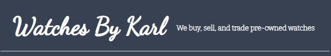
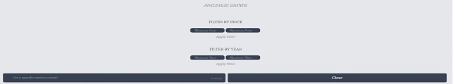
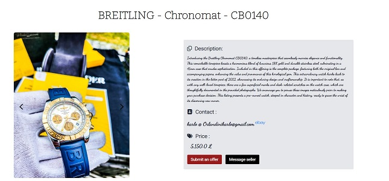
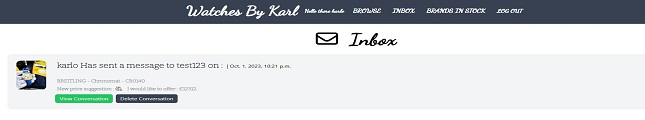

# Watches By Karl

**Description:** Watches By Karl is a Django-based web application for buying, selling, and trading pre-owned watches. Our platform caters to watch enthusiasts, offering a curated collection of high-quality pre-owned watches, including renowned brands like Breitling, PANERAI, Cartier, Tudor, Tag Heuer, and Rolex. Whether you're looking to purchase, sell, or trade watches, Watches By Karl is your trusted destination.

## Table of Contents

- [Introduction](#introduction)
- [Features](#features)
- [Website Intentions](#website-intentions)
- [Creation Process](#creation-process)
  - [Strategy](#strategy)
  - [Structure](#structure)
  - [Design](#design)
  - [Surface](#surface)
- [Features](#features)
  - [Homepage](#homepage)
  - [Browse Watches](#browse-watches)
  - [Submit Offers](#submit-offers)
  - [Messaging System](#messaging-system)
  - [User Dashboard](#user-dashboard)
- [Testing](#testing)
  - [HTML Validator](#html-validator)
  - [CSS Validator](#css-validator)
  - [Lighthouse](#lighthouse)
  - [Manual Testing](#manual-testing)
  - [Issues and Their Solutions](#issues-and-their-solutions)
- [Deployment](#deployment)
- [Credits](#credits)
  - [Content](#content)
  - [Media](#media)
  - [Code](#code)

## Introduction

Watches By Karl is your go-to destination for high-quality pre-owned watches. Whether you're an avid collector, a first-time buyer, or looking to sell your watch, our platform caters to all your watch-related needs. Explore our collection, submit offers, and engage with other watch enthusiasts through our messaging system.

## Features

- **Browse a Curated Collection**: Explore a diverse and carefully curated collection of pre-owned watches.
- **Submit Offers**: Submit offers for your favorite timepieces, making it easy to negotiate and purchase.
- **Messaging System**: Engage in watch-related discussions and negotiations through our built-in messaging system.
- **User Dashboard**: Access a user-friendly dashboard for a seamless experience, where you can manage your offers and watchlist.

## Website Intentions

**For the User:**

- Quickly find out the range and prices of available watches.
- Submit offers and communicate with sellers.
- Explore and discover new watches.

**For the Site Developer:**

- Introduce the company and its services.
- Provide up-to-date information about available watches.
- Attract new customers and watch enthusiasts.

## Creation Process

### Strategy

Watches By Karl operates on a "business-to-consumer" (B2C) model, aiming to connect watch enthusiasts with pre-owned watches. The website's main purpose is to provide information about our services and create a platform for buying, selling, and trading watches.

### Structure

The website is structured to provide a user-friendly experience:

- **Homepage**: Features a captivating visual representation and slogan.
- **Browse Watches**: Displays an overview of available pre-owned watches, prices, and options.
- **Submit Offers**: Offers a user-friendly form to submit offers and request callbacks.
- **Messaging System**: Facilitates communication between users.
- **User Dashboard**: Provides a dashboard for users to manage their offers and watchlist.

### Design

I have carefully designed the website for a visually appealing experience.

**Color Scheme**:
- The project uses a color scheme that includes various shades, predominantly a combination of black, grey, and cursive fonts for specific highlighted elements.

**Fonts**:
- The fonts used in this project are selected from Google Fonts to ensure readability and aesthetics. These include 'Dancing Script', 'Roboto', and 'Bitter'.

### Surface

- **Fonts**: We use Google Fonts to ensure readability and aesthetics.
- [Google Fonts](https://fonts.google.com/): Fonts used for this project : 
  - [Roboto](https://fonts.google.com/specimen/Roboto?query=roboto)
  - [Dancing Script](https://fonts.google.com/specimen/Dancing+Script?query=dancing+script)
  - [Bitter](https://fonts.google.com/specimen/Bitter?query=bitter)
- **Color Scheme**: Our color scheme incorporates various shades to enhance visual appeal and readability.

## Features

### Homepage

- **Main Screen**: Features a captivating image and slogan.

### Browse Watches

- **Watch Selection**: Showcases detailed information about pre-owned watches.

### Submit Offers

- **User-Friendly Form**: Provides a form to submit offers and request callbacks.

### Messaging System

- **Communication**: Facilitates discussions between users.

### User Dashboard

- **Management**: Allows users to manage their offers and watchlist.

## Testing

- **HTML Validator**: Ensured HTML code passes validation.
- **CSS Validator**: Ensured CSS code passes validation.
- **Lighthouse**: Conducted performance testing for efficient loading.
- **Manual Testing**: Tested on various browsers and devices for optimal responsiveness.
- **Issues and Their Solutions**:
  - *Local CSS Display Issue*: During development, I encountered a problem with local CSS not displaying when the `DEBUG` setting was set to `False` and the project was deployed to Heroku. The solution to this issue was to include [WhiteNoise](http://whitenoise.evans.io/en/stable/) as an intermediary to serve static files efficiently.

## Deployment

The website will be deployed to Heroku. If you want to view it on your local server, Please follow these steps:

1. Clone this repository to your local machine.
2. Navigate to the project directory.
3. Install the required dependencies using `pip install -r requirements.txt`.
4. Run the application using `python manage.py runserver`.
5. Access the website at `http://localhost:8000`.

## Credits

**Content**: Our content is inspired by the world of horology and the passion of watch enthusiasts.

**Media**: Placeholder for media credits.

**Code**: Fonts were chosen from Google Fonts, and color selection was inspired by tailwind projects.

**Copilot**: Special thanks to GPT-3.5 Assistant - Alex for providing valuable assistance throughout the project, Including testing of my code for potential errors.

**Libraries and Frameworks**:
- [Tailwind CSS](https://tailwindcss.com/): Used for creating efficient, responsive designs.
- [Google Fonts](https://fonts.google.com/): Provides a wide range of fonts for improved readability and aesthetics.
- [Font Awesome](https://fontawesome.com/): Used for adding scalable vector icons and logos.

**YouTube Videos i drew inspiration from**:
- [Link 1](https://www.youtube.com/watch?v=ZxMB6Njs3ck&list=LL&index=4&t=5365s)
- [Link 2](https://www.youtube.com/watch?v=HnBluva-Gx4&list=LL&index=5)
